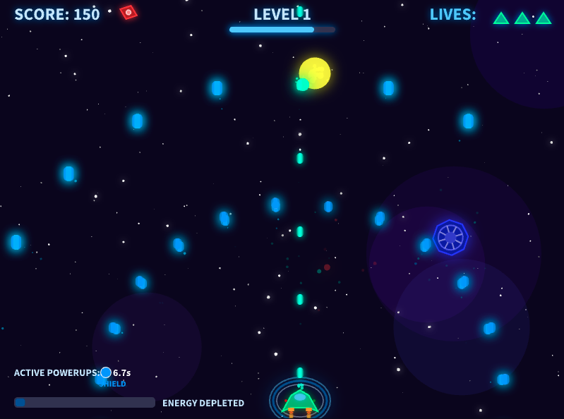

# Cosmic Defender

A fast-paced space shooter game where you defend against waves of alien invaders. Collect powerups, defeat enemies, and try to achieve the highest score!

## Play the Game

You can play the game online at: [https://yourusername.github.io/space-game](https://yourusername.github.io/space-game)

## How to Play

- **Move**: Use the left and right arrow keys to navigate your ship
- **Shoot**: Press the spacebar to fire your weapons
- **Special Attack**: Press Z when your energy bar is full to unleash a powerful special attack

## Features

- Multiple enemy types with different behaviors
- Four different powerups to enhance your abilities
- Energy system for special attacks
- Progressive difficulty as you level up
- Leaderboard to track high scores

## Powerups

Collect these powerups to gain temporary advantages:

- **Rapid Fire** (Red): Increases your firing rate
- **Triple Shot** (Green): Fires three projectiles at once
- **Speed Boost** (Yellow): Increases your movement speed
- **Shield** (Blue): Provides temporary invincibility

## Level Progression

The game gets progressively more challenging as you defeat enemies. Each level:
- Requires more enemies to be defeated
- Spawns enemies more frequently
- Rewards you with a shield powerup upon level-up

## Development

This game was built using:
- [p5.js](https://p5js.org/) for rendering and game logic
- [Supabase](https://supabase.io/) for the leaderboard functionality

## Credits

Created by [Your Name]

## License

This project is licensed under the MIT License - see the LICENSE file for details. 